# UNIVERSITY ONTOLOGY

## CSE488 Ontologies and the Semantic Web Project

## Introduction

This ontology was built for the purpose of the CSE488 course project on Ontologies and the Semantic Web. The ontology represents a university and it was implemented using Protégé, a free and open-source ontology editor and framework for building intelligent systems.

---

# Ontology Description

A university ontology is meant to describe the different aspects of a university.

We modeled the university as a set of departments, and a bunch of staff.

Each department has a single manager, a set of instructors, a set of courses taught within each department, and students enrolled into the department.

Each course can be either a core course or an elective course.

Each student can be either an undergraduate student or a graduate student.

Finally, each staff can be either a manager or an instructor.

# Classes/Entities

| Class                  | Subclass of |
| ---------------------- | ----------- |
| University             | thing       |
|                        |             |
| Department             | University  |
| ArtificialIntelligence | Department  |
| ComputerScience        | Department  |
|                        |             |
| Staff                  | University  |
| Instructor             | Staff       |
| Manager                | Staff       |
|                        |             |
| Course                 | University  |
| CoreCourse             | Course      |
| ElectiveCourse         | Course      |
|                        |             |
| Student                | University  |
| GraduateStudent        | Student     |
| UndergraduateStudent   | Student     |

---

# Object Properties/Relationships

## #hasDepartment

| Domain     | Range      |
| ---------- | ---------- |
| University | Department |

## #hasStaff

| Domain     | Range |
| ---------- | ----- |
| University | Staff |

## #hasStudent

| Domain     | Range   |
| ---------- | ------- |
| University | Student |
| Department |         |

## #isEnrolled

| Domain  | Range      |
| ------- | ---------- |
| Student | Department |

## #isManagerOf

| Domain  | Range      |
| ------- | ---------- |
| Manager | University |
|         | Department |

## #isTeaching

| Domain     | Range  |
| ---------- | ------ |
| Instructor | Course |

**Disjoint With:** `#takes`

## #registeredBy

| Domain | Range   |
| ------ | ------- |
| Course | Student |

**Inverse Of:** `#takes`

## #takes

| Domain  | Range  |
| ------- | ------ |
| Student | Course |

**Inverse Of:** `#registeredBy`

**Disjoint With:** `#isTeaching`

---

# Data Properties/Attributes

## #address

| Domain   | Range      |
| -------- | ---------- |
| #Staff   | xsd:string |
| #Student |            |

## #code

| Domain      | Range      |
| ----------- | ---------- |
| #Department | xsd:string |
| #Course     |            |

## #course_credit_hours

| Domain  | Range      |
| ------- | ---------- |
| #Course | xsd:double |

## #dob

| Domain   | Range        |
| -------- | ------------ |
| #Student | xsd:dateTime |
| #Staff   |              |

## #id

| Domain   | Range   |
| -------- | ------- |
| #Staff   | xsd:int |
| #Student |         |

## #name

| Domain   | Range      |
| -------- | ---------- |
| #Staff   | xsd:string |
| #Student |            |

## #salary

| Domain | Range   |
| ------ | ------- |
| #Staff | xsd:int |

## #student_gpa

| Domain   | Range      |
| -------- | ---------- |
| #Student | xsd:double |

---

# Instances

## Instance Relations

### Departments

### Courses

### Students

### Staff

# University

# Object Properties Constrains

## University

| Relationship | Constrain | Cardinality  | Range |
| --- | --- | --- | --- |
| #hasDepartment | exactly | 2 | #Department |
| #hasManager | exactly | 1 | #Manager |
| #hasStudents | min | 50 | #Student |
| #hasStaff | min | 10 | #Staff |

## Department

| Relationship | Constrain | Cardinality  | Range |
| --- | --- | --- | --- |
| #hasManager | exactly | 1 | #Manager |
| #hasStudnets | max | 100 | #Student |
| #hasStudents | min | 10 | #Student |
| #hasInstructor | min | 2 | #Instructor |

## Staff/Instructor

| Relationship | Constrain | Cardinality  | Range |
| --- | --- | --- | --- |
| #isTeaching | max | 4 | #Course |
| #isTeaching | min | 1 | #Course |

## Student

| Relationship | Constrain | Cardinality  | Range |
| --- | --- | --- | --- |
| #isEnrolled | exactly | 1 | #Department |
| #takes | max | 6 | #Course |
| #takes | min | 3 | #Course |

## Course
---

## RDF Graph

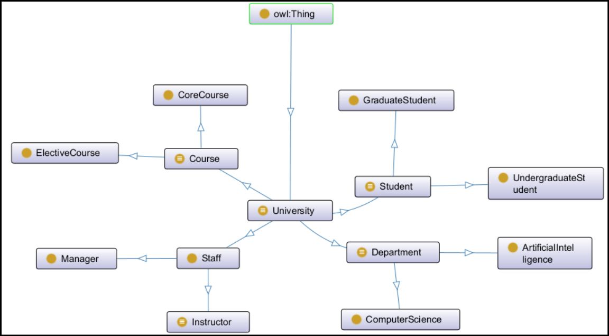

## Entity Constraints

- entity 1:
  - Constraint 1
  - Constraint 2

## Data Property Constraints

- Data Property 1:
  - Constraint 1
  - Constraint 2

## Java Application

We have two version for the java application, version 1 is to use the select menue to choose the query and version 2 is to use the text field to write the query.

### GUI

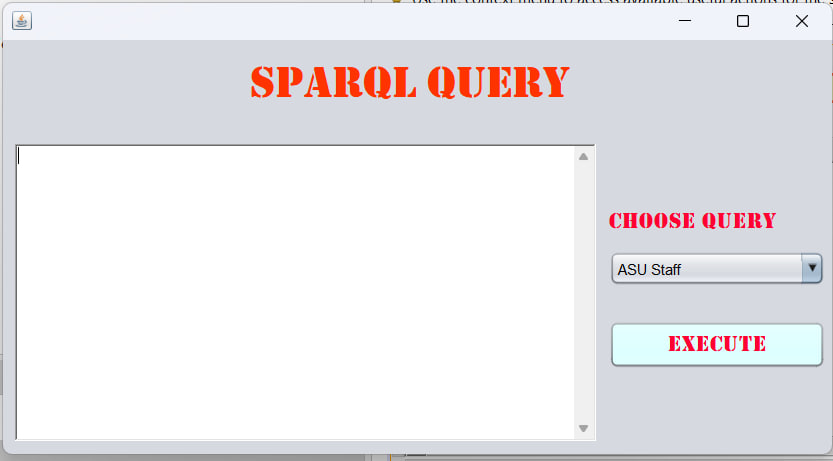
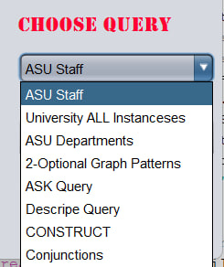

### Sample inputs and Outputs

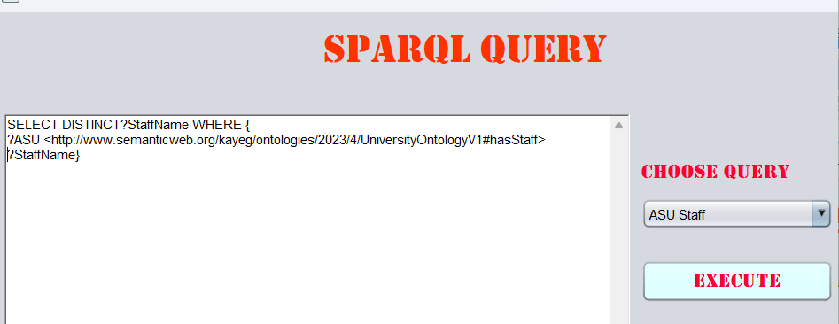
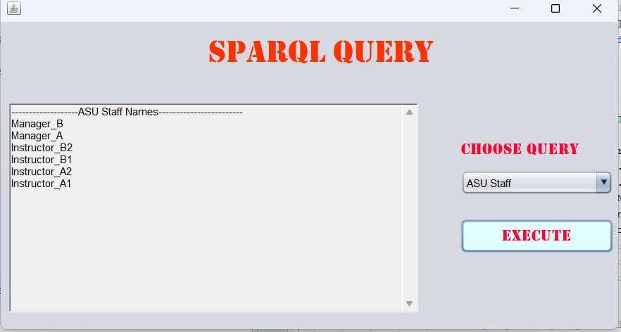
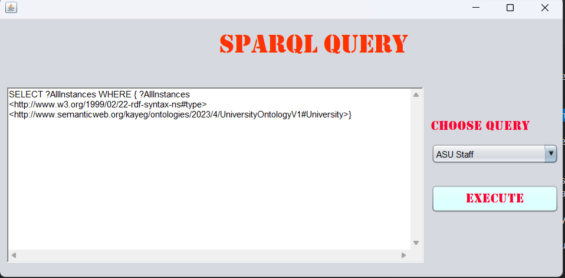
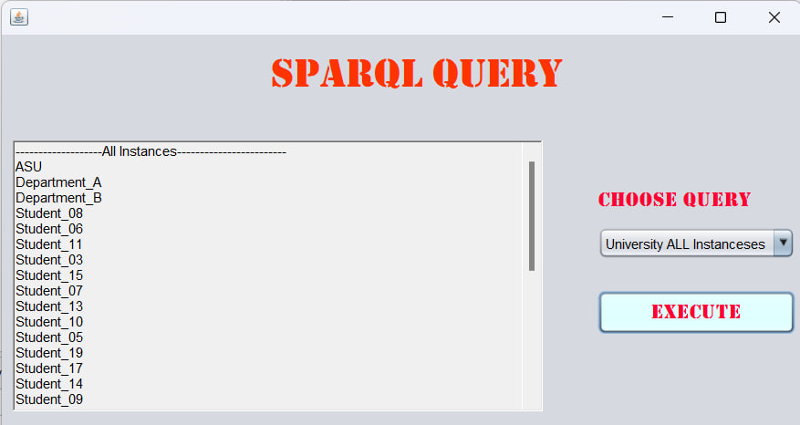
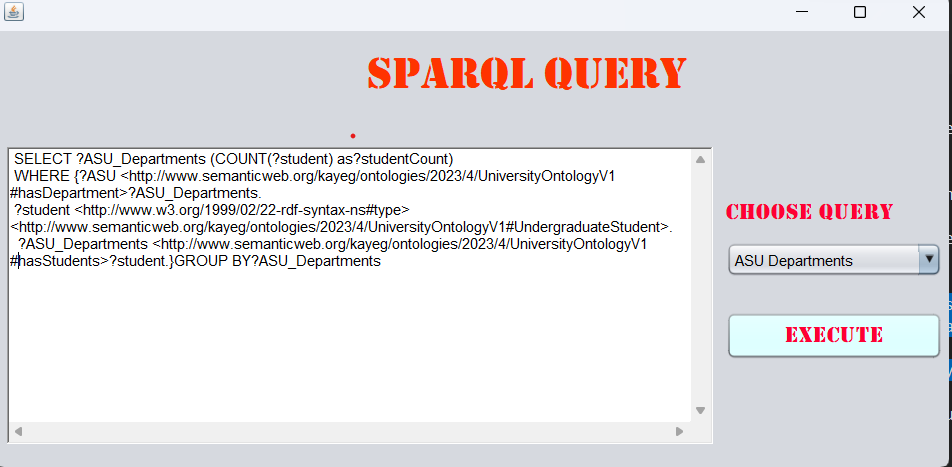
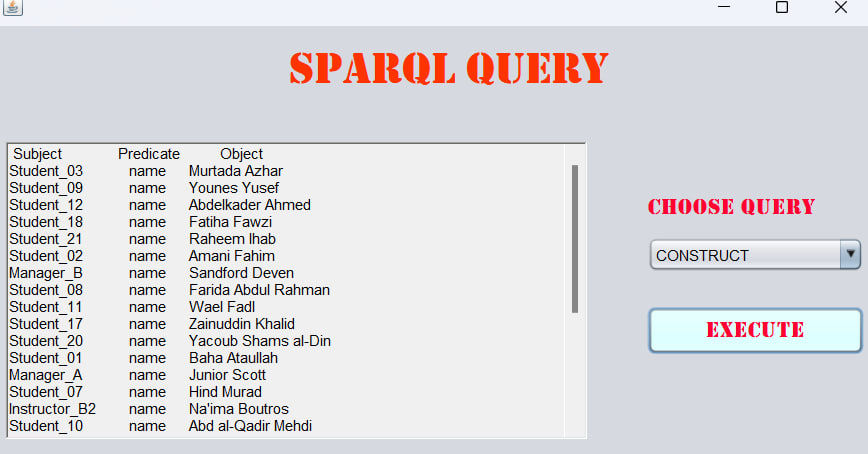
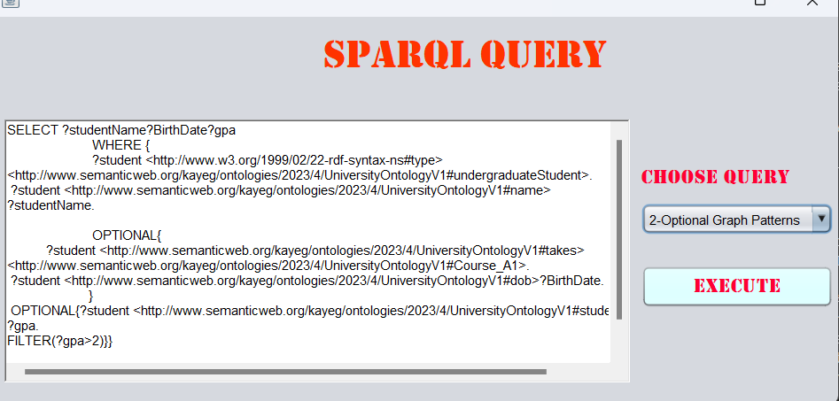

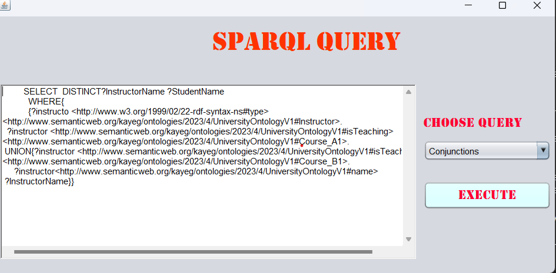
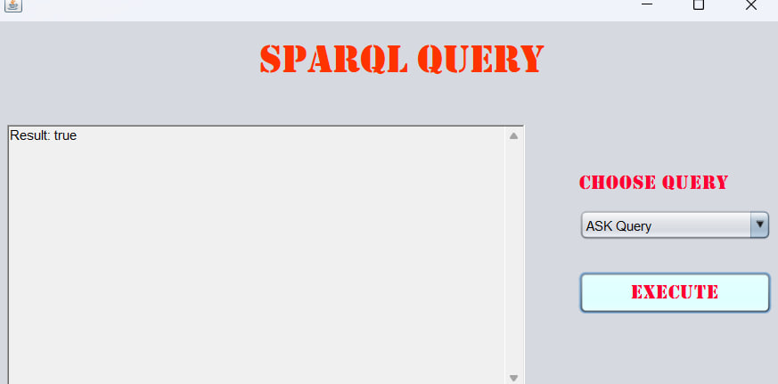

## SPARQL Queries

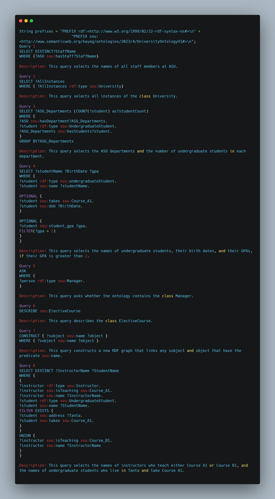

## Usage

The ontology can be used as a knowledge representation tool for modeling a university system. It can be extended and customized to fit specific use cases, such as creating a university course catalog or managing student enrollment.

## Installation

To use this ontology, you will need to have the following software installed on your system:

- Protégé: A free and open-source ontology editor and framework for building intelligent systems. You can download the latest version of Protégé from the official website: https://protege.stanford.edu/

- Apache Jena: A free and open-source Java framework for building Semantic Web and Linked Data applications. You can download the latest version of Apache Jena from the official website: https://jena.apache.org/download/

- NetBeans: A free and open-source Integrated Development Environment (IDE) for developing Java applications. You can download the latest version of NetBeans from the official website: https://netbeans.apache.org/download/

Once you have all the required software installed, you can open the ontology file in Protégé by selecting "File" > "Open" and selecting the .owl file. You can also use Apache Jena and NetBeans to develop Semantic Web and Linked Data applications that use this ontology.

## License

This ontology is licensed under the Creative Commons Attribution 4.0 International (CC BY 4.0) license. You are free to use, share, and adapt the ontology for any purpose, as long as you give appropriate credit to the original author(s).

## Acknowledgements

This ontology was developed as part of the CSE488 course project at faculty of engineering - Ain Shams University by

- [Kareem Amr - 18P9093](<https://github.com/[Kareem-Amr](https://github.com/KAYounes)>)
- [Mohamed Sameh - 17p3033](https://github.com/mxsameh)
- [Mohamed Markam - 19p2645](https://github.com/mohamedmakram1)
- [Ahmed Ashraf - 18P2981](https://github.com/Ahmed-Ashraf-Marzouk)
- [Ahmed Ali - 18P2517](https://github.com/Ahmed-Abou-Emran)

Special thanks to Assoc. Prof. Ensaf Hussein and Eng. Dina Amr for their guidance and supportthroughout the project.
